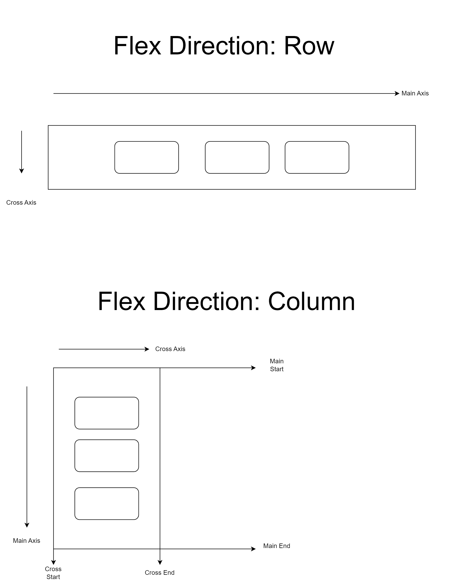

# FlexBox

Flexbox is a layout model in CSS that provides a more efficient way to design and structure the layout of items within a container. It's designed to make it easier to align, distribute, and reorder elements within a container, especially when dealing with dynamic or unknown sizes of the elements.

Here are some key concepts and features of Flexbox:

1. **Flexible Box**: Flexbox allows you to create a flexible layout where items can grow or shrink to fill the available space within the container.

2. **Container and Items**: Flexbox works by defining a flex container (using `display: flex;` or `display: inline-flex;`) and placing flex items inside it. The container becomes a flex container, and its children become flex items.

3. **Main and Cross Axis**: Flexbox layout operates along two axes: the main axis and the cross axis. The main axis is determined by the `flex-direction` property, and the cross axis is perpendicular to it.

4. **Flex Direction**: The `flex-direction` property determines the main axis of the flex container, which can be horizontal (row) or vertical (column).

5. **Flex Items Alignment**: Flexbox provides properties like `justify-content` and `align-items` to align flex items along the main and cross axes, respectively.

6. **Flex Item Ordering**: Flex items can be reordered using the `order` property, allowing you to change the visual order without changing the order in the HTML markup.

7. **Flex Item Growth and Shrinkage**: Flex items can grow or shrink based on available space and defined flex properties (`flex-grow`, `flex-shrink`, and `flex-basis`).

8. **Flex Wrap**: Flexbox also supports wrapping flex items onto multiple lines when there's not enough space within the container. This behavior is controlled by the `flex-wrap` property.

Overall, Flexbox provides a powerful and intuitive way to create complex layouts with CSS, making it easier to build responsive and dynamic web designs.


# **_Container Properties_**

# Dispay Flex

Display flex se container ke items left se right a jate hn

```css
.selector {
  display: flex;
}
```

# Justify content.

### 1- flex start

items horizontally start mn a jate hn

```css
.selector {
  justify-content: flex-start;
}
```

### 2- flex end

items horizontally end mn a jate hn

```css
.selector {
  justify-content: flex-end;
}
```

### 3- Center

Items ko horizontally center kr deta he

```css .selector {
 justify-content: center;
}
```

# Align items

### 1- flex start

items vertically start mn a jate hn

```css
align-items: flex-start;
```

### 2- flex end

items vertically end mn a jate hn

```css
align-items: flex-end;
```

### 3- center

items vertically center mn a jate hn

```css
align-items: center;
```

# Flex Direction

### 1- Default

By default Left to right hota he

```css
flex-direction: default;
```

### 2- Column

column mn vertically show kre ga (upper se niche )

```css
flex-direction: column;
```

### 3- Column- Reverse

column reverse mn vertically show kre ga (niche se upper )

```css
flex-direction: column-reverse;
```

### 4- Row

Row mn sare items vertically a jayege (start se end tk)

```css
flex-direction: row;
```

### 5- Row-Reverse

Row mn sare items vertically a jayege (end to start tk)

```css
flex-direction: row-reverse;
```

# Flex Axis



## Justify Contant in main axis

Justify content hamesha main axis ko dekh kr kse bhi containers ko center mn krta he

agr flex direction row he to justify content main axis ko dekh kr horizontally center kr dega items ko

agr flex direction column he to justify content main axis ko dekh kr vertically items ko center kr dega


# Flex Wrap

### 1- Wrap

Zyada items honge to unko wrap kr dega next line mn leke a jayega

```css
flex-wrap: wrap;
```

### 2- no wrap

ak he line mn sare items a jayete next line mn nhi ayege

```css
flex-wrap: nowrap;
```

### 3- wrap reverse

Sare items ko reverse kr dega (end se start tk leke a jayega)

```css
flex-wrap: wrap-reverse;
```

# Align contact

### 1- center

Align item jab use krte hn jab hamare pas ak se zyada line hote hn hamare sare lines ko center mn leke a jayega

```css
align-content: center;
```

### 2- flex start

flex start se sara ka sare start mn a jayega

```css
align-content: flex-start;
```

### 3- flex end

flex end se sara ka sara end mn a jayega

```css
align-content: flex-end;
```

# Flex Flow

Do properites ak sath de sakte hn is mn

```css
flex-flow: row wrap;
```

# Gap

Is ko style mn use krke bhi ham items mn gap de sakte hn

```css
gap: 30px;
```

### 1-Row Gap

Row ke bitch mn gap leke a jayega

```css
row-gap: 40px;
```

### 2-Column Gap

Column ke bitch mn gap leke a jayega

```css
column-gap: 50px;
```

### 3- Gap (row column)

Is se ham row and coloum mn ak sath gap de sakte hn first value row ke hote he second value column ke

```css
gap: 40px 10px;
```

# **_Items Property_**

# Orders

Age kse bhi item ko kse khas order mn lana he to uske liye order ke property use kre ge.
By default items ka order 0 hota he jitna ap orer zyada krte rhe ge item utna end mn ate rhe ge

```css
 <style>
      .items {
        font-size: 50px;
        height: 100px;
        width: 90px;
        background-color: blue;
        /* margin: 4px; */
        border: 2px solid red;
      }
      .order1 {
        order: 1;
      }
      .order2 {
        order: 2;
      }
      .order3 {
        order: 3;
      }
      .order4 {
        order: 4;
      }
    </style>
  </head>
  <body>
    <div class="container">
      <div class="items">0</div>
      <div class="items">0</div>
      <div class="items order3">3</div>
      <div class="items order2">2</div>
      <div class="items order1">1</div>
      <div class="items order4">4</div>
    </div>
  </body>

```


Agr ham is image mn dekhen to ye sare items order ke waja se one buy one aye hn warna ham ne inko age piche define keya tha

# Flex Grow

Flex grow se ham apne container mn jitne mn items mn unko set kr sakte hn. By default iske value 0 hote he.

```css
flex-grow: 1;
```

ham ne iske 1 kr de is se ye huwe ke hamare jitne bhi width se to sare items equally width leke adjust ho jayege


### For one items

Agr kse bhi ak item ko

```html css
<style>
  .items {
    flex-grow: 1;
    font-size: 50px;
    height: 100px;
    width: 90px;
    background-color: blue;
    /* margin: 4px; */
    border: 2px solid red;
  }
  .item1 {
    flex-grow: 2;
  }
</style>
<body>
  <div class="container">
    <div class="items item1">0</div>
    <div class="items">0</div>
    <div class="items order3">3</div>
    <div class="items order2">2</div>
    <div class="items order1">1</div>
    <div class="items order4">4</div>
  </div>
</body>
```

ak item ko flex grow 2 dene se wo items 2 items ke jga lega


# Flex shrint

jis item pr ham ne flex shrint lgaya huwa he wo items shrink ho jayega

```css
flex-shrink: 2;
```


# Align Self

Kse ak item ko handle krna hoto is se kr sakte hn

```css
.item1 {
  align-self: flex-start;
}
.item2 {
  align-self: flex-end;
}
```


