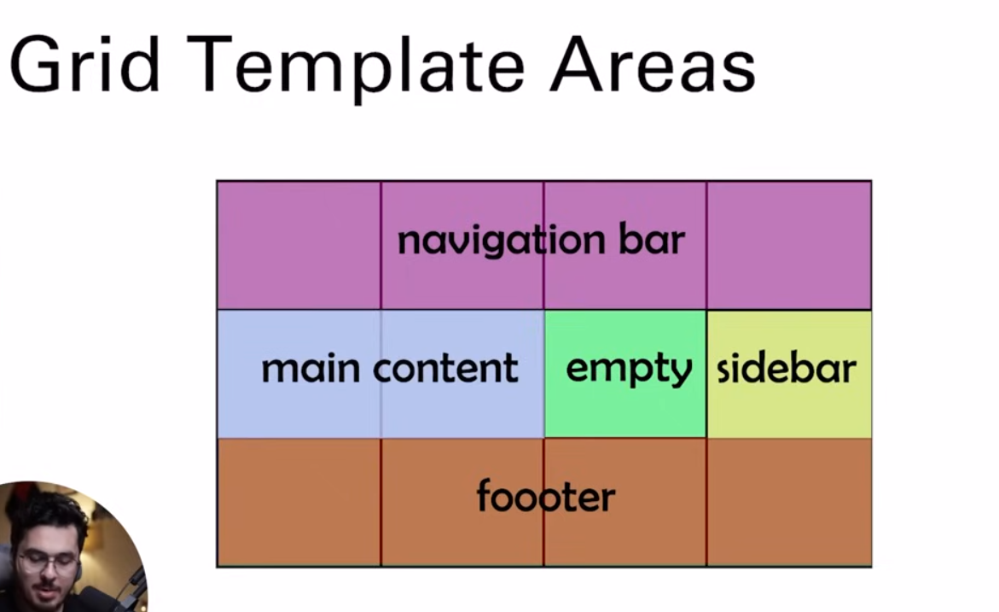
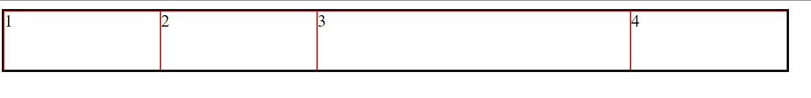

# fr units

ham jo width denge to us ke hisab se 1 fr count hoga jese agr 80 width dete hn and 4 bar 1fr dete hn to 20 20 width ke 4 columns bna dga

```css
grid-template-columns: 1fr 2fr 1fr 1fr;
```

Agr hame 1 fr ke bohat sare columns bnane hn ya rown bnane hn to ham repeat mn jitne columns ya row bnane he wo de denge and usko 1fr de denge.

```css
grid-template-columns: repeat(5, 1fr);
```


yha pr ham ne ak 2 fr de deya he to wo hamare 2 columns ke jga lega

# Gap

Gap ko use krke ham row our columns dono ko gap de sakte hn ak sath bhi and alag alag bhi

```css
gap: 30px;
```

# Row Gap

is ko use krke just rows ke bitch mn gap de sakte hn

```css
row-gap: 30px;
```

# Column Gap

Isko use krke columns ke bitch mn gap de sakte hn

```css
columns: 30px;
```

# min max

min max use krke ham bta sakte hn kam se kam kitne width ho zyada se zyada kitne ho

```css
grid-template-columns: repeat(5, minmax(20px, ifr));
```

[Video](https://www.youtube.com/watch?v=7AgEjgUtho4&list=PLu0W_9lII9agq5TrH9XLIKQvv0iaF2X3w&index=39)
