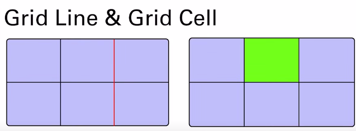
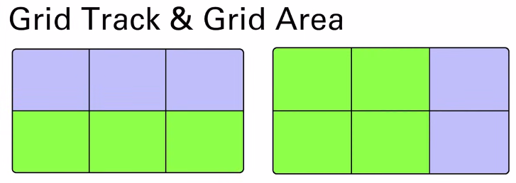
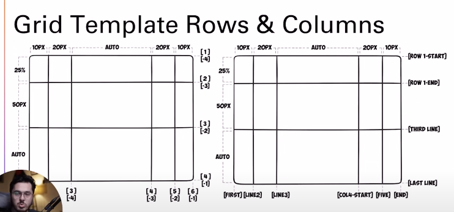
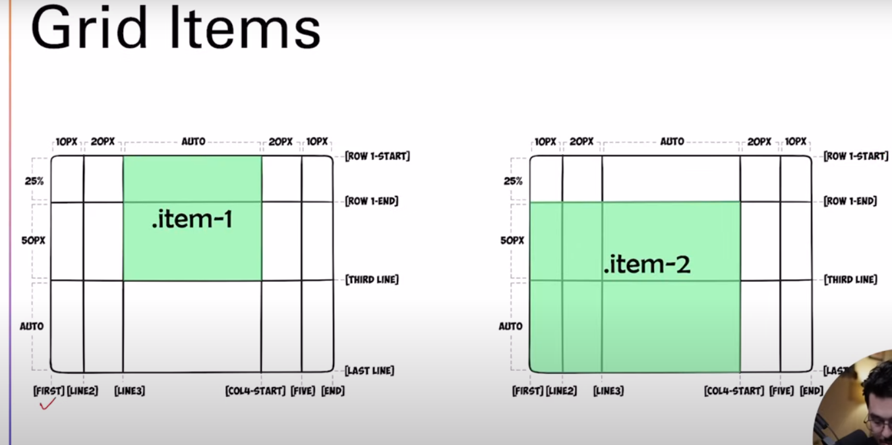

# CSS Grid

Just like FlexBox, CSS Grid with the use of rows and columns, make it easier to style website elements.

CSS display property allows two grid properties: Grid and Inline Grid. The elements placed in the grid container are called grid items.

Most of the properties of Grid are similar to FlexBox.

## Grid lines & Grid Cell



- Is mn jo lines he Wo grid lines khelate hn
- jo green color ka box he wo cells khelata he.

## Grid Track & Grid Area



- 2 grid lines mn jitne bhi space hoge wo grid track khelate hn
- grid ke andar jo area hota he usko grid area khete hn.



-
-
-

# Display Grid

Hamare container ko grid bna dega

```css
display: grid;
```

Grid mn ham define kr sakte hn kitne row ho and kitne columns ho

### 1 Grid Template

Ye property hamare container ko 2 120px ke columns mn divide kr dege

```css
grid-template-columns: 120px 120px;
```

### Adjust Items

Is tra kse bhi item ko ham apne hisab se arrange kr sakte hn

```css
    <style>
      .container {
        border: 2px solid black;
        display: grid;
        grid-template-columns: 120px 120px;
      }
      .items {
        border: 2px solid red;
        height: 45px;
        width: 55px;
      }
      .item4 {
        grid-row: 1/2;
        grid-column: 1/2;
      }
    </style>
  </head>
  <body>
    <div class="container">
      <div class="items">1</div>
      <div class="items">2</div>
      <div class="items">3</div>
      <div class="items item4">4</div>
      <div class="items">5</div>
      <div class="items">6</div>
      <div class="items">7</div>
      <div class="items">8</div>
      <div class="items">9</div>
    </div>
  </body>
```

### Overlapping items

Is se ham ak item ke uper dosra item overlap krwa sakte hn

```css
    <style>
      .container {
        border: 2px solid black;
        display: grid;
        grid-template-columns: 120px 120px;
      }
      .items {
        border: 2px solid red;
        height: 45px;
        width: 55px;
      }
      .item4 {
        /* grid-row-start: 1;
        grid-row-end: 2; */
        grid-row: 1/2;
        /* grid-column-start: 1;
        grid-column-end: 2; */
        grid-column: 1/2;
      }
      .item1 {
        grid-row: 1/2;
        grid-column: 1/2;
      }
    </style>
  </head>
  <body>
    <div class="container">
      <div class="items item1">1</div>
      <div class="items">2</div>
      <div class="items">3</div>
      <div class="items item4">4</div>
      <div class="items">5</div>
      <div class="items">6</div>
      <div class="items">7</div>
      <div class="items">8</div>
      <div class="items">9</div>
    </div>
  </body>
```

### Define name in Properties

Is tra se ham properties ke name define kr sakte hn

```css
grid-template-columns: [first] 120px [second] 120px [third] 120px;
grid-template-rows: [first] 100px [second] 100px [third] 100px;
```

Is tra se isko uske kr sakte hn

```css
.item4 {
  grid-column: second/third;
  grid-row: first/second;
}
```

