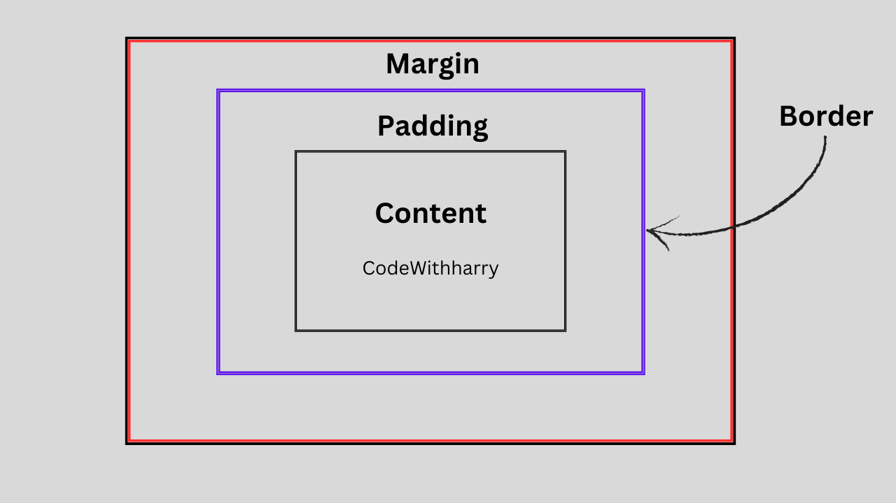

# CSS BOX MODEL:

The CSS Box model defines how elements are rendered and how their dimensions are calculated.
It describes the structure of an element as a rectangular box that has content, padding, a border, and a margin.
The box model consists of four main components, which are

## CONTENT:

The innermost component of the box model is the actual content of the element. It can be text, image, video, etc.
The content area is defined by the width and height properties.

## PADDING:

The space between the actual content and the border of the element is the padding.
The padding area is defined by the property padding. For more details, follow the CSS Padding tutorial.

## BORDER:

The border surrounds the content and padding and gives the visual border of the element.
The border properties can be controlled using the border keyword. For more details, follow the CSS Borders tutorial.

## MARGIN:

The margin is the space outside the element that separates it from other elements in the layout.
The margin of the element is controlled by the margin property.

### CALCULATION THE TOTAL DIMENSION OF ELEMENT:

The total width and height of the element is calculated with the formula:
Total Width = Width + Left Padding + Right Padding + Left Border + Right Border + Left Margin + Right Margin
Total Height = Height + Top Padding + Bottom Padding + Top Border + Bottom Border + Top Margin + Bottom Margin
